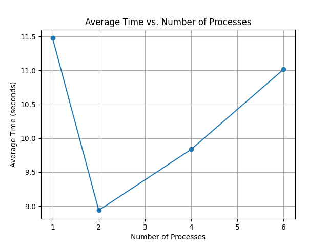

# Parallelizing HyperLogLog for Scalable Cardinality Estimation

## Abstract

This document explores the application of parallel processing to the HyperLogLog (HLL) algorithm for scalable cardinality estimation on large datasets. It discusses how HLL works, the motivation for parallelizing its computation, the process of merging partial sketches, and the potential for evaluating cardinality at the row level. It also outlines relevant data visualization strategies and presents considerations for future development and performance evaluation.

---

## Introduction

Estimating the number of distinct elements, or cardinality, in large datasets is a common requirement in data analysis, network monitoring, and database systems. Traditional counting methods are often infeasible due to high memory consumption and processing time. To address this, **HyperLogLog (HLL)** has emerged as a probabilistic algorithm that offers high accuracy with low memory usage. It utilizes hashing techniques and statistical analysis to approximate cardinalities efficiently.

However, as data volumes continue to grow, even efficient algorithms like HyperLogLog can face scalability issues. This motivates the incorporation of **parallel processing** to further reduce computation time. This documentation discusses the feasibility and benefits of parallelizing HLL sketch computations, particularly when applied to transaction data.

---

## Background: Understanding HyperLogLog

The **HyperLogLog algorithm** estimates the cardinality of a dataset using a compact and fixed-size data structure called an HLL sketch. It operates by hashing each input element and counting the number of leading zeros in each hash value. The rationale is rooted in probability theory: the number of leading zeros in a uniformly distributed hash function correlates with the rarity (and thus quantity) of distinct elements.

Once a sufficient number of hash values are observed, the algorithm estimates the cardinality using a harmonic mean-based formula. Despite its probabilistic nature, HLL provides accuracy within a predictable error margin, making it well-suited for big data applications.

---

## Parallel Processing for HyperLogLog

### Motivation

As datasets scale into millions or billions of records, the computational burden of hashing and updating the sketch increases. **Parallel processing** allows for partitioning the dataset across multiple processors or cores. Each processor computes a **partial HLL sketch** independently, reducing wall-clock time significantly.

### Sketch Combination via Update Operation

A key strength of the HyperLogLog algorithm is its **mergeability**. Partial sketches computed on different data partitions can be **combined** into a unified sketch. This is achieved through an `update` operation, which compares and merges registers from two sketches to produce a final sketch representing the union of all elements observed.

This property makes HLL highly suitable for distributed computing environments such as map-reduce pipelines or parallel multi-core processors.

---

## Data Analysis 

To demonstrate and validate the usefulness of HLL within a transactional dataset, we propose a focused visualization strategy using features from the dataset:

- **UnitPrice (Mean):**  
  Represents the average transaction price per customer. This smooths price fluctuations and captures purchasing tendencies.

- **Quantity (Sum):**  
  Reflects the total number of items purchased. Summing this feature provides a measure of customer purchase volume.

- **StockCode (Count):**  
  Captures the number of unique products bought. This helps understand customer variety preferences and shopping habits.

The dataset used includes the following features:
```python
['InvoiceNo', 'StockCode', 'Description', 'Quantity', 'InvoiceDate', 'UnitPrice', 'CustomerID', 'Country']
```

---

## Cardinality Estimation Performance

To evaluate the performance and scalability of HyperLogLog (HLL) in estimating the cardinality of unique elements within the dataset, we conducted extensive experiments across multiple columns. We compared the actual number of unique elements with the estimated cardinality produced by HLL for each selected column: `InvoiceNo`, `StockCode`, `Quantity`, `InvoiceDate`, `UnitPrice`, `CustomerID`, and `Country`.

### **Estimation Accuracy**

| Column      | Actual Unique Elements | Estimated Cardinality |
| ----------- | ---------------------- | --------------------- |
| InvoiceNo   | 25,900                 | 25,938                |
| StockCode   | 4,070                  | 4,039                 |
| Quantity    | 722                    | 725                   |
| InvoiceDate | 23,260                 | 23,256                |
| UnitPrice   | 1,630                  | 1,623                 |
| CustomerID  | 4,373                  | 4,382                 |
| Country     | 38                     | 38                    |

*Table 1: Demonstration of Actual Vs. Estimated Cardinalities*

As evident, the estimations are consistently close to the actual values, validating HLL’s reliability. Notably, even columns with high cardinality like `InvoiceNo` and `InvoiceDate` show minimal error.

---

### **Scalability with Parallel Processing**

To investigate the runtime efficiency of HLL under different levels of parallelism, we applied multiprocessing using varying numbers of processes (1, 2, 4, 6, 8). The aim was to determine the optimal number of processes that minimizes execution time while estimating cardinalities across all selected columns.

**Figure 1** plots the average time taken versus the number of processes. Surprisingly, the results demonstrate a non-linear relationship. While the execution time decreases when increasing from 1 to 4 processes (12.17s to 10.75s), further increases in parallelism lead to increased execution times—peaking at 13.32s with 6 processes.

This overhead is likely due to the cost of process creation and data partitioning outweighing the benefit of parallel computation when data size per process becomes too small. The best trade-off between parallel speed and overhead was observed with 4 processes, making it a practical choice for mid-sized datasets.



---

## Summary

Initial increases in the number of processes generally lead to reduced computation time due to workload distribution. However, beyond a certain threshold, the overhead of managing multiple processes and the limits of hardware concurrency may cause **diminishing returns or increased computation time**.

Thus, the efficiency of parallelization is closely tied to system architecture and the nature of the dataset.

---

## Future Work: Row-wise Cardinality Estimation

### The Challenge

While column-wise cardinality estimation is well-established, evaluating cardinality **at the row level** introduces significant **computational complexity**. With millions of rows, computing a unique HLL sketch per row becomes memory- and time-intensive, challenging the feasibility of real-time or large-scale processing.

### Proposed Solution

We propose applying **parallelized row-level sketching**, where independent processes compute row-level cardinalities in parallel. This method would serve as a demonstration of the **scalability and performance** benefits of combining parallel computing with HyperLogLog.

### Performance Evaluation

A thorough performance benchmark is planned to compare:
- **Parallel row-wise computation**
- **Single-threaded row-wise computation**
- **Column-wise cardinality estimation**

This evaluation will offer insights into how effectively parallelism reduces computation time and resource usage in practice.

---

## Conclusion

The HyperLogLog algorithm remains a powerful tool for cardinality estimation, especially in big data contexts. By introducing **parallel processing**, its utility can be extended even further. This approach not only improves performance but also opens the door to complex applications such as **row-wise cardinality estimation**, enabling more granular and scalable data analysis.

---

